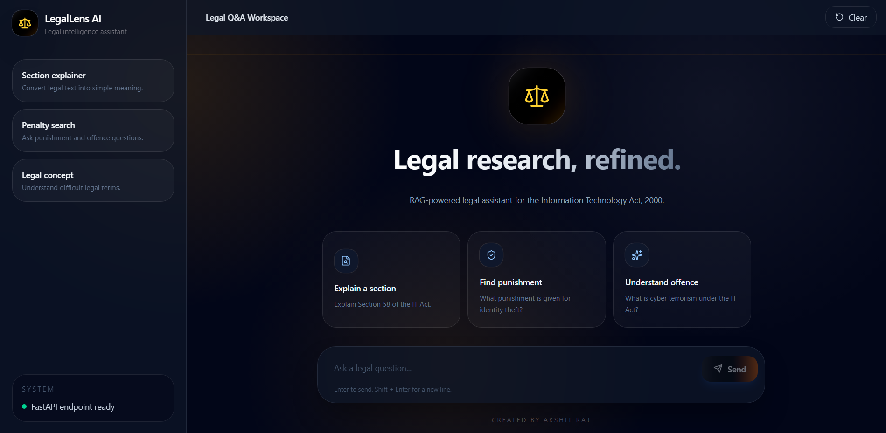

# LegalLens


.png)
.png)

## Live Demo

🚀 **Deployed App:** [LegalLens on Vercel](https://legal-lens-2-5.vercel.app/)

🎥 **Quick Video Demo:** [YouTube Demo](https://www.youtube.com/watch?v=qHVS_Av24Hw&list=PLxi7oBxXioe8Y-6NwhUHNSblNTRE92fCe)

---

## Overview

**LegalLens** is an API-based legal question-answering assistant built around **The Information Technology Act, 2000**.

The project uses a **Retrieval-Augmented Generation (RAG)** pipeline.  
That means the system does not blindly send the user question to an LLM. Instead, it first finds the most relevant legal sections from the IT Act and then generates an answer using that retrieved context.

In simple words:

> User asks a question → LegalLens finds the right IT Act sections → AI answers using those sections.

This makes the answer more grounded, focused, and less likely to hallucinate.

---

## What the Project Does

- Takes the **Information Technology Act, 2000** as the source document
- Extracts and cleans legal text from the PDF
- Splits the law into structured section-level chunks
- Stores each section with metadata such as chapter, section number, and content
- Generates synthetic user-style questions for better retrieval
- Converts legal sections and user queries into embeddings
- Retrieves the most relevant sections using semantic similarity
- Sends the retrieved context to Gemini API models for answer generation
- Uses an automatic fallback mechanism when one model/API path fails
- Handles different query types using optimized routing logic
- Exposes the system through a **FastAPI backend**
- Deploys the application on **Vercel**

---

## Key Features

- **RAG-based legal assistant** for the IT Act, 2000
- **Section-level legal retrieval** instead of random document chunks
- **Gemini Embedding API** for semantic search
- **Gemini API-based answer generation**
- **Automatic fallback mechanism** for better reliability
- **Custom query routing**
  - Direct section lookup for exact section questions
  - Lightweight path for simple/general queries
  - Full RAG path for complex legal questions
- **FastAPI backend** for API-based interaction
- **Vercel deployment** for public access
- **Synthetic question generation** to improve retrieval quality
- **Prompt constraints** to keep answers grounded in retrieved legal context

---

## How It Works

### 1. PDF Extraction and Cleanup

The IT Act PDF is first converted into usable text.

Legal PDFs usually contain noise such as:

- page numbers
- broken spacing
- headers and footers
- formatting issues
- amendment notes
- extra symbols

So the extracted text is cleaned before retrieval. This matters because messy text creates bad search results later.

---

### 2. Section-Level Chunking

After cleaning, the Act is split into meaningful legal sections.

Each section is stored with metadata like:

- chapter name
- section number
- section title
- section text

This helps the system retrieve precise legal sections instead of sending the whole document to the model.

---

### 3. Synthetic Question Generation

Users usually ask questions in normal language, but legal documents are written in formal language.

Example:

- User may ask: **"What happens if someone hacks my account?"**
- Law may say: **"unauthorised access to computer resource"**

To reduce this gap, LegalLens generates possible user-style questions for each legal section and stores them with the section data.

This improves retrieval because the system can match natural user questions better.

---

### 4. Embedding-Based Retrieval

LegalLens converts both the legal sections and the user question into embeddings.

An **embedding** is just a number-based representation of meaning.  
So instead of matching only exact words, the system compares meaning.

The retrieval flow is:

1. User asks a question
2. Question is converted into an embedding
3. Stored legal section embeddings are compared with the question embedding
4. Top matching sections are selected
5. These sections are passed as context to the LLM

---

### 5. API-Based Answer Generation

After retrieval, the selected legal sections are inserted into a controlled prompt.

The answer is generated using Gemini API models, with instructions to answer only from the retrieved context.

This helps reduce unsupported or made-up answers.

---

### 6. Fallback Mechanism

LegalLens uses a fallback mechanism to improve reliability.

If one API/model path fails because of rate limits, errors, or availability issues, the system can try another configured fallback path instead of instantly breaking.

This makes the application more stable for real usage.

---

### 7. Query Routing

Not every question needs the same heavy pipeline.

LegalLens uses custom routing logic:

| Query Type | System Path |
|---|---|
| Exact section question | Direct section lookup |
| Simple/general question | Lightweight answer path |
| Complex legal question | Full RAG pipeline |
| Failed model/API call | Fallback model path |

This improves speed and reduces unnecessary API usage.

---

## Tech Stack

- **Python**
- **FastAPI** for backend API
- **Gemini API** for answer generation
- **Gemini Embedding API** for embeddings
- **NumPy** for vector operations
- **Cosine Similarity** for semantic retrieval
- **PyMuPDF / PyMuPDF4LLM** for PDF extraction
- **Regex** for legal text cleaning and parsing
- **JSON** for structured legal section storage
- **Vercel** for deployment
- **GitHub** for version control

---

## API Flow

```text
Frontend
   ↓
FastAPI /ask endpoint
   ↓
Query Router
   ↓
Direct Lookup OR RAG Retrieval
   ↓
Gemini API
   ↓
Fallback Handling if needed
   ↓
Final Answer
```

---

## Example Use Cases

LegalLens can answer questions like:

- What is Section 66 of the IT Act?
- What is the punishment for hacking?
- What does the IT Act say about identity theft?
- Which section deals with cyber terrorism?
- What are the powers of the Controller under the IT Act?

---

## Challenges Solved

A major challenge was improving retrieval quality.

Legal documents are tricky because:

- definitions can appear in many places
- some sections are very broad
- user language is different from legal language
- exact keyword search often fails
- LLMs can hallucinate if context is weak

To handle this, the project uses:

- section-level chunking
- semantic embeddings
- synthetic question generation
- direct section lookup
- prompt constraints
- fallback model logic
- separate query paths for different question types

---

## Current Scope

LegalLens currently focuses only on **The Information Technology Act, 2000**.

It is not a general legal advisor.  
It is a focused document-grounded assistant for answering questions from this specific Act.

> ⚠️ Disclaimer: This project is for educational and informational purposes only. It is not professional legal advice.

---

## Future Improvements

Planned improvements include:

- better ranking for confusing legal sections
- stronger evaluation of retrieval quality
- support for more Indian legal documents
- user feedback collection
- improved frontend design
- citation-style answers with section references
- caching for faster repeated queries

---

## Setup Instructions

### 1. Clone the Repository

```bash
git clone https://github.com/rezzraj/LegalLens.git
cd LegalLens
```

### 2. Install Dependencies

```bash
pip install -r requirements.txt
```

### 3. Add Environment Variables

Create a `.env` file:

```env
GEMINI_API_KEY=your_api_key_here
```

### 4. Run the FastAPI Backend Locally

```bash
uvicorn server:app --reload
```

### 5. Test the API

Open:

```text
http://127.0.0.1:8000/docs
```

Or send a POST request to:

```text
/ask
```

Example request body:

```json
{
  "question": "What is the punishment for hacking under the IT Act?"
}
```

---

## Conclusion

LegalLens is a deployed API-based RAG legal assistant that combines semantic retrieval, structured legal parsing, Gemini API generation, fallback handling, and custom query routing.

The main goal of the project is not just to make an AI answer legal questions, but to build a more reliable system that first retrieves the right legal context and then generates an answer from it.

